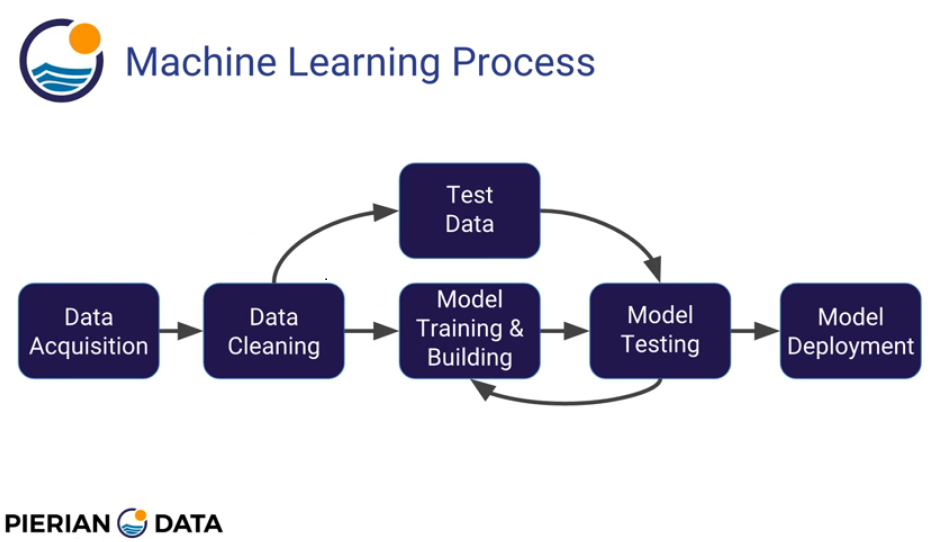

# Machine-Learning-with-Python

This repository serves as public storage for notes and projects related to machine learning with Python

**Inspired by:**

__*[Python for Data Science and Machine Learning Bootcamp, Pierian Data](https://www.udemy.com/python-for-data-science-and-machine-learning-bootcamp/)*__

## Introduction

###What is machine learning?

While working at IBM, **Arthur Samuel** originally coined the term **machine learning** in 1959 and defined it as the "field of study that gives computers the ability to **LEARN** without being explicitly programmed."

A more technical definition was later formed by **Tom Mitchell**, who proposed in 1998 that machine learning algorithms "**LEARN** from experience E with respect to some task T and some performance measure P, if its performance on T, as measured by P, improves with experience E." __*[Source](https://www.ibm.com/developerworks/community/blogs/jfp/entry/What_Is_Machine_Learning?lang=en_us)*__.

The SAS Institue, a modern leader in the field, defines machine learning as a "**method of data analysis that automates analytical model building.** It is a branch of artificial intelligence based on the idea that systems can **LEARN** from data, identify patterns and make decisions with minimal human intervention." __*[Source](https://www.sas.com/en_us/insights/analytics/machine-learning.html)*__.

Like a well-oiled statician, a machine learning algorithm applies statistical learning techniques to identify valuable patterns in data.

__*[A visual introduction to machine learning by R2D3](http://www.r2d3.us/visual-intro-to-machine-learning-part-1/?lipi=urn%3Ali%3Apage%3Ad_flagship3_pulse_read%3BR9B4rGtnTmSrw4DAoezDjQ%3D%3D)*__.

###3 Main Types of Machine Learning Algorithms

**Supervised learning** algorithms are trained using **labeled** data, or data with an assigned "tag", "label", or "class" that gives it desirable meaning. This labeled data is often expensive and usually obtained by asking humans to make judgements about unlabeled data. __*[Source](https://stackoverflow.com/questions/19170603/what-is-the-difference-between-labeled-and-unlabeled-data)*__.

So for example, a supervised learning algorithm recieves a set of inputs along with corresponding correct outputs and the algorithm learns by comparing the actual output with the correct outputs to find errors. The algorithm uses this newfound information along with methods such as **classification, regression, prediction, and gradient boosting.** to modify its model of understanding. __*[Source](https://www.udemy.com/python-for-data-science-and-machine-learning-bootcamp/)*__.

After a couple rounds of this training, the algorithm may then be used to predict labels for additional unlabeled data. 

These models are used primarily with historical data that can predict future events. For example, to anticipate real estate market pricing based on features and historical price data.

What about data with no existing meaningful labels?

**Unsupervised learning** algorithms use that kind of **unlabeled** data to learn. These algorithms are not given any correct outputs and must explore data to find patterns within. Popular techniques include **self-organizing maps, nearest-neighbor mapping, k-means clustering and singular value decomposition.** Now don't you worry because we'll be covering these later with hands-on projects. __*[Source](https://www.udemy.com/python-for-data-science-and-machine-learning-bootcamp/)*__.

Last but definitely not least, think sophisticated Skinner Box.

**Reinforcement learning** algorithms learn through trial and error, discovering which actions yield the greatest reward.

###print('Machine Learning with Python')

__*[Source](https://medium.com/@powersteh/an-introduction-to-applied-machine-learning-with-multiple-linear-regression-and-python-925c1d97a02b)*__.

